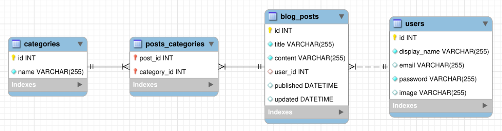

# Blogs API #

In this project an API and a database were developed for the production of content for a blog. This API was made in Node.js following software architecture model MSC. 

## ER and Entity Diagram ##
The relational database, represented in the figure below, was created using Sequelize (Object-relational map) to do a structural mapping between database entities and the objects they represent in JavaScript code. Endpoints were developed to connect to the database following REST principles.



## Guidelines to runnig API ##
This project can be run locally or using docker. Whichever resource you choose, both use environment variables. To runnig this API, follow these steps below:

### :whale: Docker ###
1. Clone the repository: ```git clone git@github.com:carinacunha/blogs-api.git```
2. Navigate to the root of the repository: ```cd blogs-api```
3. Make sure you have installed docker version 1.29 or higher
4. Run the node and db services with the command: ```docker-compose up -d --build```
5. Create an interactive terminal from the container: ```docker exec -it blogs_api bash```
6. Install the dependencies: ```npm install```

### :computer: Local ###
1. Clone the repository 
  - git@github.com:carinacunha/project-blogs-api.git
2. Navigate to the root of the repository
3. Make sure you have installed node version 16
4. Install the dependencies: ```npm install```

**✨ This project was developed during the Full Stack Web Development course at Trybe.**
